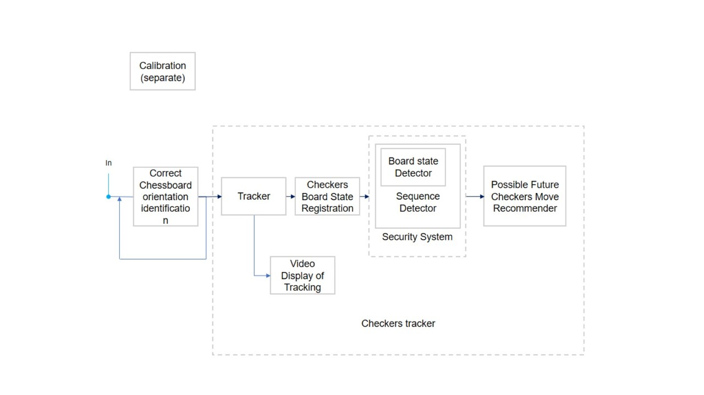

# Computer Vision Project - Checkers Tracker

## A project on tracking using OpenCV to register a Checkers game and detect the pieces in real time with a Raspberry Pi and a PiCamera

This project was developed with the purpose of tracking a checkers game in real time, whilst visualizing the board and pieces in the computer. The pieces are differentiated by color, so we have not used black and white pieces, but rather red and green ones. We have also included a calibration jupyter to calibrate the camera, if necessary, but we did not need to use it for our checkers program due to the high quality of the PiCamera. To implement sequencing, in order to unlock the tracker, a certain sequence of movements must be performed. 

## Authors
- Ignacio Bayón Jiménez-Ugarte
- Antonio Mora Abós

## Explanation

1. Calibration
Calibration implemented using the OpenCV library. These are the simplified steps we have followed to calibrate the camera:

    1.1. Find the chessboard corners of the given image with `findChessboardCorners`

    1.2. Refine the corners found with `cornerSubPix`

    1.3. Draw the corners found with `drawChessboardCorners`

    1.4. We have impleented the function `get_chessboard_points` to get the points of the chessboard in the real world

    1.5. Calibrate the camera with `calibrateCamera` from OpenCV, giving as inputs the object points (real points) and the image points (chessboard corners found), and receiving the rmse, the intrinsics, the distortion coefficients and the extrinsics.

2. Checkers Tracker 

    a. `password.py`
    This file contains the sequence required to unlock the tracker. 

    b. `checkers.py`
    This file contains the main code for the tracker. Functions explained:

    - `get_chessboard`: This function receives the full scale image received from the camera, the corners found in the image and the chessboard size and returns a warped image of the chessboard. This process is made possible by two OpenCV functions:

        - `getPerspectiveTransform`: This function receives the source points (the 4 outer corners of the chessboard) and the destination points (the 4 cornes of the image) and returns the perspective transformation matrix.

        - `warpedPerspective`: This function receives the image, the transformation matrix and the image size abd returns the warped image.

    - `chessboard_to_matrix`: This function received the warped image of the chessboard and the chessboard shape (8x8 in our case, a standard checkers board) and returns the matrix with 0s, 1s and -1s representing the empty squares, the green pieces and the red pieces, respectively.

    We do so itering by chessboard's boxes and detecting the circles within, using OpenCV's `HoughCircles` function. If a circle is found, we will check its mean red color and assign a 1 / -1 to the box depending on a certain threshold, chosen by us, which might vary depending on the lighting conditions. We then draw the circles found with `drawCircles`. If no circle is found, we will assign a 0 to the box. We finally return the matrix.

    - `main`
    We have implemented a main function that firstly detects and starts the picamera.
    
    1. Detecting initial state: A problem which we have had is that the chessboard was squared, so it would detect the board in the natural way (pieces up and down) and rotated (pieces left and right) indistinctly. To solve this, we have put a loop that will hold the program until the board is detected in the natural way (received from the `password` function). This is unnoticeable for the user, and can be considered as an initiation protocol, as there is a 50/50 chance of the board being detected correctly, and each iteration does not take long.

    2. Once the board is detected, we will start the main loop, which will iterate until the program is stopped.

        2.1. Crop the image: done instantly. As the camera and the board are not moved, our initial crop we have just explained will be valid for the whole game.
        
        2.2 We then get the chessboard_matrix and register the chessboard state if it is a new state.
        
        2.3 When each new state is registered, we will check with the password function if the sequencing is correct.

## Results
We have got very good results with the tracker. The camera is able to detect the pieces in real time and the sequencing works perfectly too. The color detection was very accurate, but as we have mentioned earlier on, the project is subject to the lighting conditions and depends on it to an certain extent. Nevertheless, we are very much satisfied with the results obtained, as we have achieved our main goal, which was to track a checkers game in real time keeping a register of the board states.

To see the execution, please check the video (if you have access). 

## Future improvements
As we have seen, as the tracking is done from the start, there is no actual use for the sequencing. We have considered the sequencing could unlock a certain recommendation tool that could guide you in the checkers game. This tool could consist of a function that, given the current state of the board, would recommend you the best move to do. We could use a database of checkers games to train a neural network (deep learning) and possibly allow the algorithm to play against istelf for further training. This would be a very interesting project to develop in the future.

## Diagram

